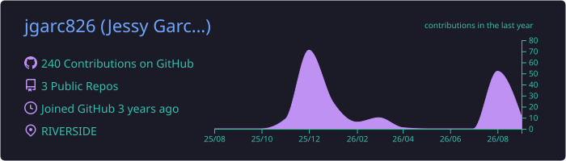
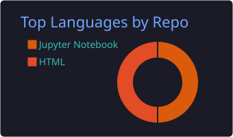
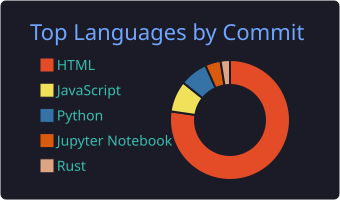

# Hey, I'm Jessy 👋

**Data science student @ UC Riverside · building toward software engineering**

## 🧭 About me

- 🎓 Data science major at **UC Riverside**, working toward a software engineering career
- 🤖 Building **[Canvas-Student](https://github.com/Dekamayaro/Canvas-Student)** through my UCR fellowship — an AI agent that helps students manage their Canvas coursework
- 🐝 Contributing upstream to **[wasm-bpf](https://github.com/eunomia-bpf/wasm-bpf)** — a WebAssembly runtime for eBPF programs

## 🚀 What I've shipped

| Project | What I did |
| --- | --- |
| **[Canvas-Student](https://github.com/Dekamayaro/Canvas-Student)**  UCR fellowship | AI student agent for Canvas. Built the test suite and CI pipeline ([#102](https://github.com/Dekamayaro/Canvas-Student/pull/102)), now adding coverage for the Google Calendar tools. |
| **[wasm-bpf](https://github.com/eunomia-bpf/wasm-bpf)**   | Landed fd-based attach for cgroup/sockops in both the **Rust** ([#160](https://github.com/eunomia-bpf/wasm-bpf/pull/160)) and **C++** ([#163](https://github.com/eunomia-bpf/wasm-bpf/pull/163)) runtimes, plus a CI build fix ([#162](https://github.com/eunomia-bpf/wasm-bpf/pull/162)). |

## 🛠️ Tech stack

   

## 📊 GitHub stats

 

⚙️ Cards regenerate automatically every week via GitHub Actions

